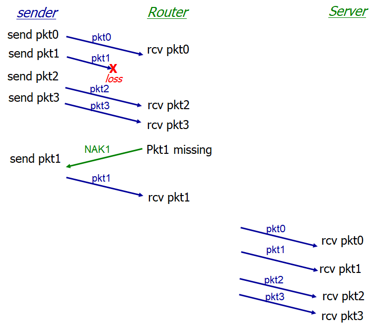
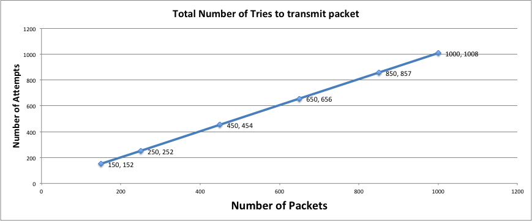
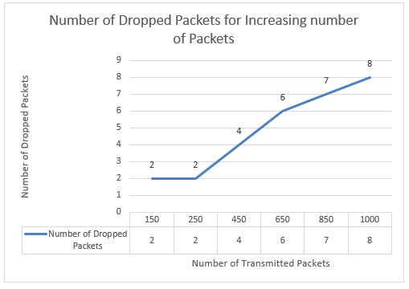
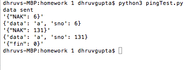
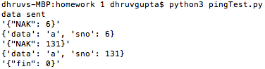
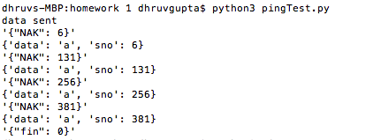
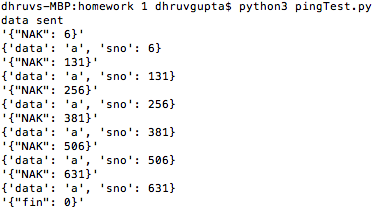
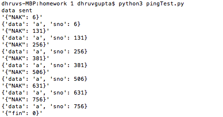

1.  **Design and Protocol**

In this project we have implemented three network devices:

-   Sender

-   Router

-   Reciever / Server

The sender sends the data to the router in n packets. The router uses
store and forward, and hence does not send the packets to the final
destination till it has received all the packets.

In the scenario described, the router will send a NAK for every missing
packet from the sender instead of sending an ACK for every packet that
has been received, the router stores the rest of the packets till all
the packets have been received, proceeding to send the entire message to
the sender in a pipelined fashion. The router does through the received
packet and creates a NAK message if a missing sequence number is found,
it will insert the missing packet before requesting the next missing
packet.

On receiving a NAK the sender retransmits to the router. The sender is
constantly listening for a NAK till the connection close request is
received. The connection to the router is closed when the router
successfully forwards the message to the receiver.

Figure 1 Illustration of packet transmission process implementing
Selective Repeat w/ NAK

2.  **Plot - Successful Transmissions**

Figure 2: Graph showing the increase in dropped packets with increase in
number of packets

3.  **Max Throughput**

  Number of Packets  | Number of Dropped Packets  | Attempts  | Throughput
  -------------------| ---------------------------| ----------| ------------
  150                | 2                          | 152       | 148 / 150
  250                | 2                          | 252       | 248 / 250
  450                | 4                          | 454       | 446 / 450
  650                | 6                          | 656       | 644 / 650
  850                | 7                          | 857       | 843 / 850
  1000               | 8                          | 1008      | 992 / 1000

Table : Packet drop data collected from system implementation

4.  **Throughput Discussion**

Throughput is the amount of data that can be transferred between end
systems. The instantaneous throughput at any instant is the rate at
which a host is receiving the file in bits/sec. Average throughput is
the scenarios where F bits being transferred take T seconds, the average
throughput is said to be F/T bits per second.

Throughput depends on the following factors:

-   Transmission Delay

-   Propagation Delay

-   Nodal Processing Delay

-   Queuing Delay

Propagation delay can be minimized by accessing hosts in close
proximity. Eg. Accessing Google servers in the US instead of accessing
the google servers in India.

Transmission delay can be reduced if network equipment with larger
bandwidth is used.

Queuing delay is a factor of increased network traffic as well as a
router low bandwidth or unreliable medium. Ideally if a router with
larger bandwidth is deployed, and a reliable medium which doesn't drop
packets is used, the queuing delay can be minimized.

5.  **[Output]{.underline}**

Figure 3: Sender showing the NAKs received from dropped packets when
sending 150 packets

Figure 4: Sender receiving NAKs when transmitting 250 packets

Figure 5: Sender receiving NAKs when transmitting 450 packets

Figure 6: Sender receiving NAKs when transmitting 650 packets

Figure 7: Sender receiving NAKs when transmitting 850 packets

Figure 8: Sender receiving NAKs when transmitting 1000 packets
