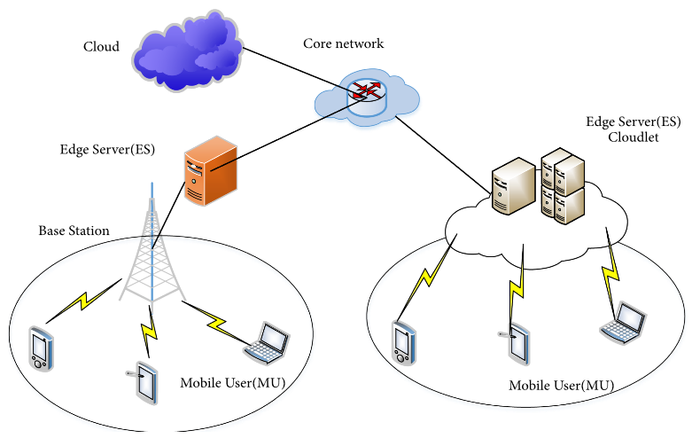
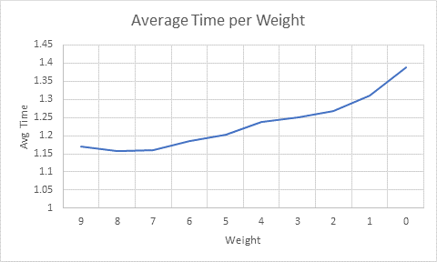
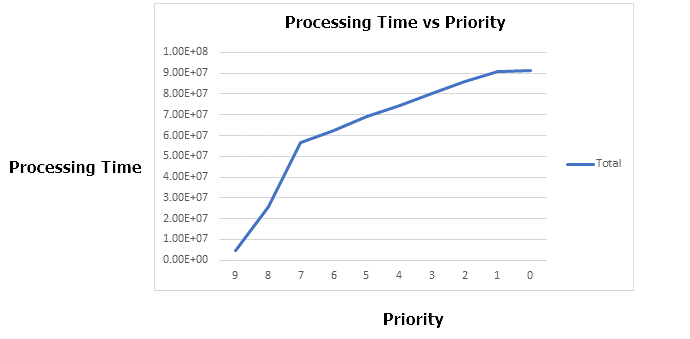
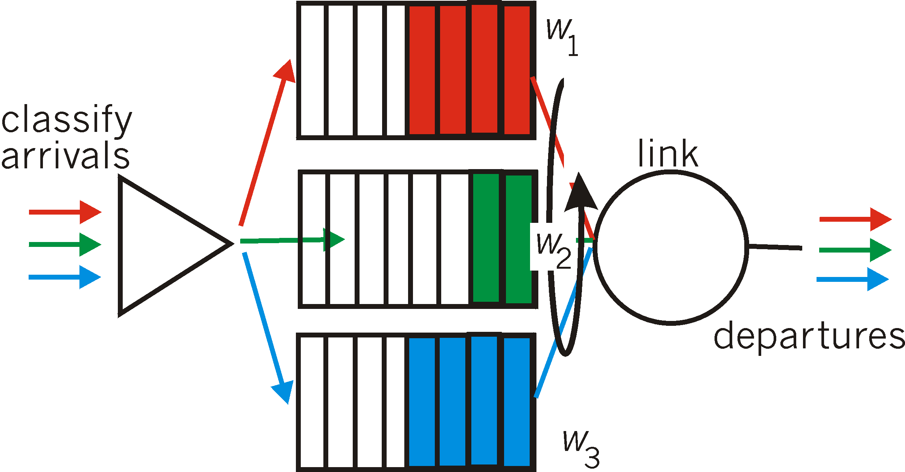
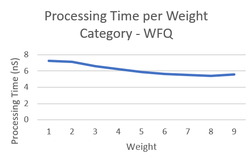
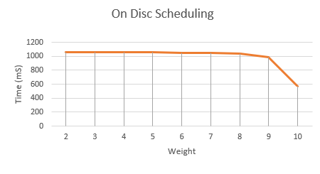
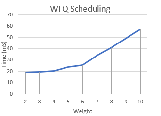
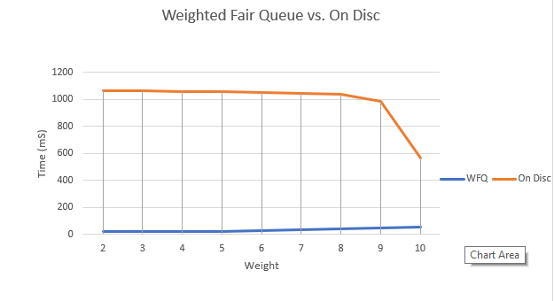

# Improved Scheduling for Mobile Edge Networks Using On-Disc Algorithm
 
### Introduction 

With the advent of technologies like IoT, 5G and artificial intelligence we need better computing technology for faster processing. The need of the hour has become to not only have bigger pipes for data transfer but also address emerging concerns such as addressing network delays. New network architecture are being proposed to address some of these concerns.

Cloud computing has become the flavor of the season, but with increasing data volumes, latency and congestion has become a mammoth issue which is bottleneck for new innovations on the application layer. One such step in this direction is the onset and division of some computation geared towards the mobile BS (Base Stations) or edge clouds. Edge clouds are resource constrained servers deployed close to the mobile base stations which can perform computation closer to the user instead of routing the request all the way to the remote server. This helps in reducing and helps addressing the issue of congestion in the long run. Edge cloud servers can be reached by nearby mobile users via wireless connections. 

In this way, mobile devices can offload their tasks to edge clouds and receive the computing results with low network latency. However, because these specially deployed servers are of smaller scale than the remote ones, the resource and computation abilities of edge-clouds are relatively constrained and pose a scalability challenge that we look to explore further in this paper
In this paper we try to look at a better scheduling model for the Mobile Edge Computing where we try to optimize the queue processing of the processes. Our aim is to mitigate the wait to infinity problem of small priority jobs when they are waiting for other high priority job to be processed and this in discussed in detail in the later sections. 

### MOTIVATION

The creation of network paradigms started with the original client server architecture for request processing. With the advent of internet and a huge surge in computation power aided by exponential increase in mobile devices led to the need of having access to information all around us at all the times. Hence, the processing power was moved to a remote server granting devices access even when they were mobile. This is commonly referred to ‘Cloud Computing’. This was the story 

of about five years ago but with increasing number of mobile users and more resource hungry applications, this doe not seem to be enough and hence we need faster response time. This led to the concept of Mobile Edge Computing or MEC.

Mobile Edge Computing (MEC) is like a cloud server which is running at the edge of a mobile network. Better performance of MEC is key to the future because growth in Mobile traffic will augment in the future as the Mobile devices becomes smarter and the end user is drawn to use the Mobile device for most of their daily tasks, which were earlier handled by Personal Computers.

Practical Applications of MEC:

- MEC is the key player in implementation of 5G. MEC will reduce the latency for 5G networks.
- Increased use of live streaming (YouTube, Netflix) on the mobile devices, can lead MEC to reduce the latency.
- Augmented Reality.
- Autonomous Vehicles can benefit from the MEC, as low latency is the key to operating autonomous vehicles.

### Background
According to ‘Mobile-Edge Computing – Introductory Technical White Paper’, Traffic Offload Function (TOF) is a part of MEC application-platform services, which addresses only problem of prioritizing traffic and routing it.

As evident from Fig 1. The mobile request processing undergoes two questions to answer viz.

Whether to deploy the request to the remote server or the edge server. This is the ‘dispatching problem’, and
How to schedule the new incoming job into the existing job queue once the first question has been answered. This is the ‘scheduling’ problem.

The answers to these two questions are the backbone of mobile edge computing. The first question takes the processing power and the time taken to process the request along with the round-trip time into consideration while the second question need to find a way to deal with the existing requests in the queue once the current request reaches the queue. Practically the following kinds of jobs will be waiting in the queue:

- Jobs with higher priority than the current job in question
- Jobs with lower priority than the current job
- Jobs with similar priority when compared with the current job request.

Our aim is to make sure that every job gets processed with the fair amount of latency and wait time in the queue and it does not have to suffer long wait times since it is a low priority job and there are other high priority jobs currently waiting or are being processed in the queue.

Figure 1: Shows a Client Server architecture with Edge/Cloud servers

### Related work

This has been a topic of discussion for a long time and most of the solutions have focused on solving the scheduling problem via First Come First Serve scheme. There have been some studies on dispatching jobs to achieve load balancing but the issue with them is that they have assumed that the way in which the jobs have been released follow some kind of a stochastic process. A stochastic process is a non-deterministic process or a random process like the number of people standing in a queue at a shopping counter.
CloneCloud [1] was proposed to use cloned virtual machine images in the cloud for mobile job offloading. Tong et al. [10] proposed a hierarchical architecture for the edge-clouds. They divided the edge-clouds into different levels according to the distance to the edge, so that the peak load at the edge-clouds can be offloaded to the higher tier edge-clouds. They also presented a heuristic algorithm to dispatch the workload within this hierarchical architecture. Based on the hierarchical architecture, they designed a heuristic algorithm to dispatch the jobs according to their loads at the edge-clouds. Jia et al. [11] pointed out that the load balancing among the edge-clouds can bring huge performance gain, much more than only processing the jobs at the edge-clouds in isolation. This model is useful in the metropolitan area networks where the edge-cloud servers can communicate with a low latency. Most of the above load balancing schemes in the edge-clouds are based on stochastic optimization, for which they assume that the job release process follows a certain distribution.

They all had shown great improvement, but their underlying assumption was that all the jobs were released at the same time from the mobile device and that there was no communication latency between the mobile device and the server. This does not happen in real life as the job request can be released arbitrarily from the mobile device and in general there is always a lag between the time each request leaves a device and the time it reaches the server.
This was taken into consideration by Tan et al [12] as they considered jobs in arbitrary order and times and also attached Weighted response Time to the time sensitive jobs.
In this paper, we try to improve the scheduling approach used by Tan et al [12] and in turn improve the latency result for the various job requests. 
They have shown great improvement by the usage of their online approach but the low priority jobs in their approach will have to deal with greater waiting times in the queues and this is where our approach takes a lead. We introduce the concept of waited fair queueing for this and document the results in the coming section.

### Detailed problem statement
Computation Offloading is one of the major topics of research in Edge/Cloud computing, with various research papers talking about different aspects of job offloading to Edge/Cloud servers.

This paper presents a mathematical model to calculate the computation offloading cost (time and energy consumption) of mobile cloud application models. This paper takes more detailed approach to address the problem of Computation Offloading and breaks it down to two separate issues: dispatching and scheduling problem. The above papers focus more on context-awareness of the jobs being sent by the mobile device. In this paper they consider that the jobs are arbitrary.
That is why here Latency Sensitivity is considered as deciding factor for scheduling jobs. The algorithm On-Disc is said to be scalable and distributed [1].

### Goals:
- Dispatching the request to a server which has low processing delay (d_proc)
- Dispatching to an edge cloud vs. remote cloud (d_trans) 
- Scheduling requests at a server while keeping fairness (d_queue )
- Service migration of servlets from base station to base station

In other literature, offline algorithms have been proposed with improved running time [13] which stands in contrast to the online models discussed. 

The two parts of the algorithm:

Dispatching Policy: According to this policy the jobs are dispatched to the server which brings least increase to Weighted Response Time (WRT), i.e., dispatch the jobs greedily to server with minimum total Weighted Response Time (WRT).

Figure 2: Shows Type I and Type II jobs and ‘job’ is the job to be dispatched

Weighted Response Time=
Time to process packets of higher Priority (Type I jobs) + Time to process job + Time to Process Low Priority jobs (Type II jobs)

Scheduling Policy: Highest Residual Density First (HRDF) rule is used to schedule all unfinished jobs. In case of tie, job that arrive first has high priority.

Residual density =(weight of the job)/(processing time)

Jobs take the order in the queue based on their Residual density. If two jobs have same Residual density, the job which arrived first will be processed.

Scheduling Example:

|   Job    |   Weight   |   d_proc   |   priority=weight/d_proc    |
| ------------- |:-------------:| -----:| -----:|
|   1   |  4   |   1   |   4/1 = 4   |
|   2   |  3   |   1   |   3/1 = 3   |
|   3   |  1   |   1   |   1/1 = 1   |
|   4   |  1   |   1   |   1/1 = 1   |
|   5   |  2   |   1   |   2/1 = 2   |

In this example we have packets coming in with different weight, but the same processing times. The weight represents the priority that was assigned to them by the application. Since their size is the same, the processing delay for each packet is taken to be equal. A higher weight indicates a higher priority.
The residual density which is used as the priority for job execution in On-Disc is represented as the priority. Assuming that the jobs will not be executed till all of the jobs are in the queue, we assign them a position in queue based on their priority. 
As a result, we see that jobs 1 and 2 with the highest priority are first in the queue, Job 2, even though it came in last gets priority over Jobs 4 and 5, however Jobs 3 and 4 have the same priority so their time of arrival is used as a tie-breaker. 

Position:	1	2	3	4	5
Job: 	Job 1	Job 2	Job 5	Job 3	Job 4
Priority	4	3	2	1	1

Based on this example we ne notice that, in the online situation, if jobs like Job 2 keep coming in, jobs 3 and 4 might be waiting for a long time. To study this scenarios, the following simulation was created. 

Explanation of offline simulation 
To simulate this scenarios, two different modules were created in Java, the ‘packet creator’, and the ‘processor’. First a list of packets with random weights is created such that the distribution of packets in each weight category are almost equal but they are not in order. In the second run a list of packets is generated such the number of higher priority is generated.
The ‘processor’ will get the list of packets which it must enqueue into its incoming queue data structure ‘PQueue’ based on the calculated residual density. The processor waits for a certain time before removing the top node, the wait time is a function of the packet size and a predefined processor speed. The time the packet was added to the Priority Queue or PQueue is marked as the starting time and the time the packet’s processing ends is marked on the packet. At the end of the simulation the following results were obtained.
This approach to the simulation would add some delay in the packet being queued and processed, however since the goal is to study the impacts on a weight group, the randomness in the initial list will even out that delay in each weight group.

 We found issue with current approach related to the fairness in ‘On Disc’ scheduling algorithm. As per our analysis, we discovered that wait time for low priority jobs, in case of constant incoming packets, will be very high. Though the offline case was explored for the simulation, the results can be easily extended for n→∞.

Figure 3. Shows low priority packets very high processing times in the queue, in ‘On Disc’ Scheduling Algorithm

If high priority jobs keep coming in the low priority jobs may have to wait infinitely in the queue.

Figure 4: Shows low processing times when the traffic is skewed towards higher priority in ‘On Disc’ Scheduling Algorithm

SOLUTION
In order to solve this problem, we suggest implementing ‘Weighted Fair Queue (WFQ)’ at the edge-servers. This can address the infinite waiting time of the low priority jobs.

 
Figure 5: Illustration of Weighted Fair Queue

The weighted fair queue processes packets from each queue based on the queues’ weight class. As a result in the scenario where queues are deployed for weights 1…10, the WFQ will output 10 jobs from queue 10, 9 job from queue 9 and so on. The queue is responsible for keeping track which weight queue is next in line for dequeuing a packet.  
As a result the queues with higher weights are able to get lower latency by reduced queuing delay while also ensuring that queues with lower weight are not waiting forever. 
To simulate the results of the WFQ, another module was added to the previously discussed simulation. The WFQ and PQueue run simultaneously on different threads with the same list of input jobs. The packets in each queue are marked when they are added to the queue by the enqueue function and when they are removed by the dequeue function. The wait time used to represent processing time is the same in both cases and is dependent on the packet size. The time stamps on the packets are studied at the end of the simulation by gathering those from a log file. 
The results shown here are firstly for the case where there are an equal number of packets in each weight category to provide a fair comparison to the base case presented in Fig. 3. Followed by the comparison of the unbalanced queue which has a higher proportion of high weigh packets to simulate the situation where the users keep sending packets marked with higher weights. 

 
Figure 6: Processing time with ~2000 packets in each weight class

The graph shows that higher weight packets are still able to get a better latency than lower priority packets while all the packets were able to be processed. 

Figure 7: Packet processing times for On Disc with a skewed input

During simultaneous simulation of both algorithms, the On Disc algorithm similar results similar to the initial data set where the packets in priority 10 received substantially larger delays. The large spike from figure 4 is not seen here due to the lower number of jobs used in this case. Only 20,000 jobs were used in this simulation as opposed to 100,000 for fig. 4.

Under the same conditions the simulation for WFQ is carried out producing the results in Figure 8. The results show that longer latency for priority 10 jobs, however the number of jobs in that weight class is much larger, hence the process implemented is more fair. 

 
Figure 8: Processing time for jobs in WFQ implementation

Table 1: Job counts in each weight class for simultaneous simulation

Weights   |	  Job Count
---|---
1	   |   1
2	   |   5
3	   |   13
4	   |   34
5	   |   94
6	   |   255
7	   |   693
8	   |   1884
9	   |   5123
10   |   	11896
Grand Total   |  	 19998

Result Comparision

We were able to replicate ‘On Disc’ scheduling algorithm and compare it with our modification of it, using Weighted Fair Queue (WFQ). We see a lot of improvement in performance when compared to ‘On Disc’ scheduling algorithm.

Having different queues based on the weights of the jobs give low priority jobs to be processed without waiting for infinite times.

 
Figure 9: Comparison graph between On Disc and Weighted Fair Queue algorithm

As shown in Fig 9., the processing times for low priority jobs, with weights 2,3 or 4, in On Disc is very high. Whereas, in Weighted Fair Queue (WFQ), the processing times of low priority jobs is fairer. The weight times of the high priority packets is larger due to the fact that the weight class is relatively saturated. The magnitude difference in the running time of the 2 cases can be owed to the reason that WFQ uses the Java Framework version of the queue, whereas the On-Disc implementation required a custom queue to be created. The processing overhead of the custom queue is higher and this difference can be seen. However the takeaway should be the comparison in the shapes of the curves relative to each other. 

This improves the waiting times of the jobs in the queue and also improves fairness in the queue. While ‘On Disc’ scheduling policy suggests giving priority to high weight jobs, the low weight jobs will have almost infinite wait times in case of continuous incoming traffic. ‘Weighted Fair Queue’ solves this problem.
Conclusion
In ‘On Disc’ paper [2] we studied the online job dispatching and scheduling problem in edge-cloud systems where jobs are released in arbitrary order and times by mobile devices and offloaded to unrelated servers with both upload and download delays. We focus on the scheduling algorithm to suggest an improvement on it. We suggest using ‘Weighted Fair Queue’ at the edge-cloud systems to schedule the jobs in more efficient way. Our simulation shows ‘Weighted Fair Queue’ has a clear performance upgrade over ‘On Disc’ scheduling algorithm. This means adding fairness to the priority driven approach at the edge-cloud servers.

References

[1] B.-G. Chun, S. Ihm, P. Maniatis, M. Naik, and A. Patti, “Clonecloud: elastic execution between mobile device and cloud,” in EuroSys 2011

[2] Haisheng Tan, Zhenhua Han, Xiang-Yang Li, Francis C.M. Lau, Online job dispatching and scheduling in edge-clouds, IEEE INFOCOM 2017
Jie Xu, Lixing Chen, Pan Zho, Joint Service Caching and Task Offloading for Mobile Edge Computing in Dense Networks, pp.207–215, IEEE 2018.

[3] Y. Mao, C. You, J. Zhang, K. Huang, and K. B. Letaief, “Mobile edge computing: Survey and research outlook,” arXiv preprint arXiv: 1701.01090, 2017.

[4] W. Shi, J. Cao, Q. Zhang, Y. Li, and L. Xu, “Edge computing: Vision and challenges,” IEEE Internet of Things Journal, vol. 3, no. 5, pp. 637–646, 2016.

[5] Y. Mao, J. Zhang, and K. B. Letaief, “Dynamic computation offloading for mobile-edge computing with energy harvesting devices,” IEEE Journal on Selected Areas in Communications, vol. 34, no. 12, pp. 3590–3605, 2016.
[6] X. Ge, S. Tu, G. Mao, C.-X. Wang, and T. Han, “5g ultra-dense cellular networks,” IEEE Wireless Communications, vol. 23, no. 1, pp. 72–79, 2016.

[7] Mach, P., & Becvar, Z. (2017). Mobile edge computing: A survey on architecture and computation offloading. IEEE Communications Surveys & Tutorials, 19(3), 1628-1656.

[8] Wang, Shiqiang, et al. "Dynamic service placement for mobile micro-clouds with predicted future costs." IEEE Transactions on Parallel and Distributed Systems 28.4 (2017): 1002-1016.

[9] L. Tong, Y. Li, and W. Gao, “A hierarchical edge cloud architecture for mobile computing,” in INFOCOM 2016.

[10] M. Jia et al., “Optimal cloudlet placement and user to cloudlet allocation in wireless metropolitan area networks,” in INFOCOM 2016.

[11] Haisheng Tan,Zhenhua Han, Xiang-Yang Li, Francis C.M. Lau, Online Job Dispatching and Scheduling inEdge-Clouds at IEEE INFOCOM 2017 - IEEE Conference on Computer Communications

[12] Urgaonkar, Rahul, et al. "Dynamic service migration and workload scheduling in edge-clouds." Performance Evaluation91 (2015): 205-228 

